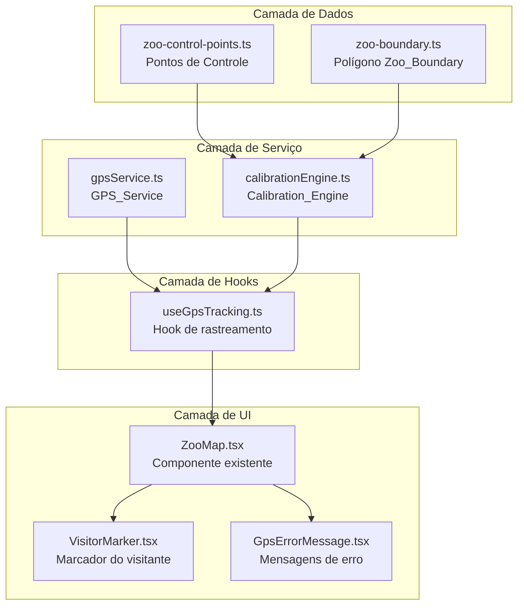
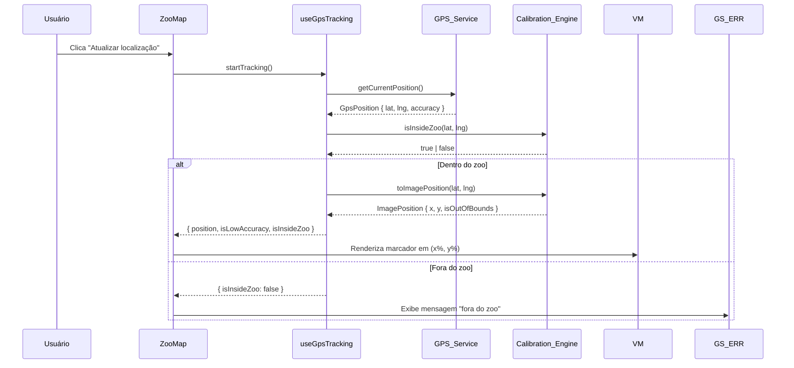
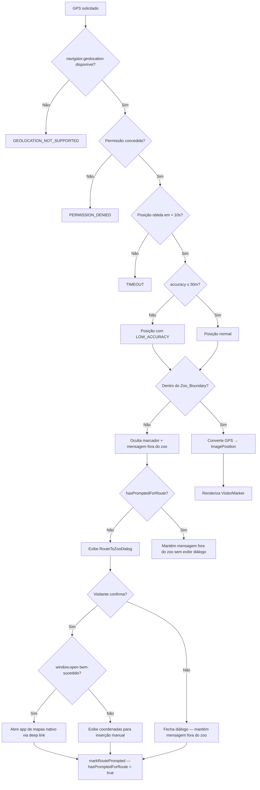

# Design Técnico — GPS Zoo Tracking

## Visão Geral

Esta feature adiciona rastreamento GPS real ao Animal Safari App, substituindo a posição simulada do visitante (`Math.random()`) por coordenadas geográficas reais obtidas via `navigator.geolocation`. O desafio central é converter coordenadas GPS (latitude/longitude) em posições percentuais (x%, y%) compatíveis com o mapa estático JPG existente do Parque Zoológico de Sapucaia do Sul (RS), publicado pela SEMA-RS.

A solução é composta por dois módulos principais:

- **GPS_Service**: obtém e monitora a posição GPS do dispositivo.
- **Calibration_Engine**: converte coordenadas GPS em posições percentuais na imagem usando transformação afim bilinear sobre pontos de controle geo-referenciados.

O componente `ZooMap.tsx` existente é estendido para consumir esses módulos via hooks React, sem quebrar nenhuma funcionalidade atual (mapa oficial, marcadores de animais, prop `onAnimalSelect`).

---

## Arquitetura

### Diagrama de Módulos



### Fluxo de Dados



---

## Componentes e Interfaces

### Estrutura de Arquivos

```
src/
├── services/
│   ├── gpsService.ts           # GPS_Service
│   └── calibrationEngine.ts   # Calibration_Engine
├── config/
│   ├── zoo-control-points.ts  # Control_Points (dados de calibração)
│   └── zoo-boundary.ts        # Zoo_Boundary (polígono GPS)
├── hooks/
│   └── useGpsTracking.ts      # Hook React principal
├── components/
│   ├── ZooMap.tsx              # Componente existente (modificado)
│   ├── VisitorMarker.tsx       # Novo: marcador do visitante
│   ├── GpsErrorMessage.tsx    # Novo: mensagens de erro GPS
│   └── RouteToZooDialog.tsx   # Novo: diálogo de rota até o zoo (Requisito 10)
└── types/
    └── gps.ts                  # Tipos TypeScript novos
```

### GPS_Service (`gpsService.ts`)

Responsável por abstrair a API `navigator.geolocation`. Expõe duas funções puras:

```typescript
// Obtém posição única
function getCurrentPosition(options?: GpsOptions): Promise<GpsResult>

// Inicia monitoramento contínuo; retorna watchId para cancelamento
function watchPosition(
  onPosition: (result: GpsResult) => void,
  onError: (error: GpsError) => void,
  options?: GpsOptions
): number

// Encerra monitoramento
function clearWatch(watchId: number): void
```

### Calibration_Engine (`calibrationEngine.ts`)

Responsável pela transformação de coordenadas. Expõe:

```typescript
// Inicializa o engine com os pontos de controle
function createCalibrationEngine(points: ControlPoint[]): CalibrationEngineResult

// Retornado por createCalibrationEngine
interface CalibrationEngine {
  toImagePosition(lat: number, lng: number): ImagePositionResult
  isInsideZoo(lat: number, lng: number): boolean
}
```

### useGpsTracking (`useGpsTracking.ts`)

Hook React que orquestra GPS_Service e Calibration_Engine:

```typescript
function useGpsTracking(): UseGpsTrackingResult

interface UseGpsTrackingResult {
  imagePosition: ImagePosition | null
  isInsideZoo: boolean
  isLowAccuracy: boolean
  isWatching: boolean
  error: GpsErrorType | null
  hasPromptedForRoute: boolean  // Requisito 10.4: controla exibição única do diálogo por sessão
  startTracking: () => void
  stopTracking: () => void
  requestSinglePosition: () => void
  markRoutePrompted: () => void  // Requisito 10.4: marca que o diálogo já foi exibido nesta sessão
}
```

### RouteToZooDialog (`RouteToZooDialog.tsx`)

Componente de diálogo de confirmação exibido quando o visitante está fora do `Zoo_Boundary`. Utiliza o componente `AlertDialog` do shadcn/ui (`src/components/ui/alert-dialog.tsx`).

```typescript
interface RouteToZooDialogProps {
  open: boolean
  onConfirm: () => void   // Usuário confirmou — abre o app de mapas
  onCancel: () => void    // Usuário recusou — fecha o diálogo
}

const RouteToZooDialog: React.FC<RouteToZooDialogProps>
```

**Comportamento:**
- Renderiza um `AlertDialog` com título "Você está fora do zoo" e pergunta se o visitante deseja obter a rota até o Parque Zoológico de Sapucaia do Sul.
- Botão de confirmação chama `onConfirm`, que internamente invoca `openMapsWithRoute()`.
- Botão de cancelamento chama `onCancel`, que fecha o diálogo sem ação adicional.
- O componente é controlado externamente via prop `open` — a lógica de exibição única por sessão fica no hook `useGpsTracking` (via `hasPromptedForRoute`).

### openMapsWithRoute (`src/services/mapsService.ts`)

Função utilitária responsável por construir e abrir o deep link para o app de mapas nativo:

```typescript
const ZOO_COORDINATES = { lat: -29.8320, lng: -51.1480 } as const;
const ZOO_MAPS_DEEP_LINK = `https://maps.google.com/maps?daddr=${ZOO_COORDINATES.lat},${ZOO_COORDINATES.lng}`;

/**
 * Abre o aplicativo de mapas nativo com rota até o Parque Zoológico de Sapucaia do Sul.
 * Retorna true se o deep link foi aberto com sucesso, false se o fallback foi acionado.
 */
function openMapsWithRoute(): boolean {
  const newWindow = window.open(ZOO_MAPS_DEEP_LINK, '_blank');
  if (!newWindow) {
    // Fallback: deep links não suportados — exibe coordenadas para inserção manual
    return false;
  }
  return true;
}
```

**Fallback (Requisito 10.5):** Se `window.open` retornar `null` (bloqueado pelo navegador ou deep links não suportados), o componente `RouteToZooDialog` exibe uma mensagem informando as coordenadas `-29.8320, -51.1480` para inserção manual no app de mapas preferido do visitante.

---

## Modelos de Dados

### Tipos TypeScript (`src/types/gps.ts`)

```typescript
/** Tipos de erro do GPS_Service */
export type GpsErrorType =
  | 'GEOLOCATION_NOT_SUPPORTED'
  | 'PERMISSION_DENIED'
  | 'TIMEOUT'
  | 'POSITION_UNAVAILABLE'
  | 'INSUFFICIENT_CONTROL_POINTS'
  | 'INVALID_CONTROL_POINT';

/** Posição GPS bruta retornada pelo GPS_Service */
export interface GpsPosition {
  latitude: number;
  longitude: number;
  accuracy: number; // metros
  timestamp: number;
}

/** Resultado de uma leitura GPS */
export type GpsResult =
  | { ok: true; position: GpsPosition; isLowAccuracy: boolean }
  | { ok: false; error: GpsErrorType };

/** Erro estruturado do GPS_Service */
export interface GpsError {
  type: GpsErrorType;
  message: string;
}

/** Posição percentual na imagem do mapa */
export interface ImagePosition {
  x: number; // 0–100
  y: number; // 0–100
}

/** Resultado da conversão GPS → imagem */
export interface ImagePositionResult {
  position: ImagePosition;
  isOutOfBounds: boolean;
}

/** Par de coordenadas GPS + posição na imagem (ponto de controle) */
export interface ControlPoint {
  /** Latitude WGS-84 (-90 a 90) */
  latitude: number;
  /** Longitude WGS-84 (-180 a 180) */
  longitude: number;
  /** Posição horizontal na imagem (0–100%) */
  imageX: number;
  /** Posição vertical na imagem (0–100%) */
  imageY: number;
  /** Descrição do local onde o ponto foi medido */
  description: string;
}

/** Opções para as chamadas de geolocalização */
export interface GpsOptions {
  timeout?: number;           // ms, padrão: 10000
  maximumAge?: number;        // ms, padrão: 0
  enableHighAccuracy?: boolean; // padrão: true
}

/** Threshold de precisão GPS aceitável (metros) */
export const ACCURACY_THRESHOLD_METERS = 50;
```

### Pontos de Controle (`src/config/zoo-control-points.ts`)

Os pontos de controle são constantes documentadas no código-fonte. Os valores abaixo são **estimativas iniciais** baseadas na localização conhecida do Parque Zoológico de Sapucaia do Sul (RS) — coordenadas aproximadas: -29.83°S, -51.15°W. Devem ser **calibrados em campo** com medições GPS reais nos locais indicados.

```typescript
import type { ControlPoint } from '@/types/gps';

/**
 * Pontos de controle para geo-referenciamento do mapa do Zoo de Sapucaia do Sul.
 *
 * COMO CALIBRAR:
 * 1. Vá fisicamente ao local descrito em cada ponto.
 * 2. Meça a coordenada GPS com o dispositivo (precisão < 10m recomendada).
 * 3. Identifique a posição correspondente na imagem do mapa (x%, y%).
 * 4. Atualize os valores de latitude, longitude, imageX e imageY.
 *
 * MÍNIMO: 3 pontos são necessários. Recomendado: 4–6 pontos bem distribuídos.
 */
export const ZOO_CONTROL_POINTS: ControlPoint[] = [
  {
    // Ponto 1: Entrada principal do zoo (portão de acesso)
    // Medido em: [DATA A PREENCHER EM CAMPO]
    latitude: -29.8320,
    longitude: -51.1480,
    imageX: 50,
    imageY: 95,
    description: 'Entrada principal — portão de acesso ao zoo',
  },
  {
    // Ponto 2: Área do lago central (margem norte)
    // Medido em: [DATA A PREENCHER EM CAMPO]
    latitude: -29.8305,
    longitude: -51.1465,
    imageX: 82,
    imageY: 32,
    description: 'Margem norte do lago central',
  },
  {
    // Ponto 3: Área de carnívoros (recinto dos felinos)
    // Medido em: [DATA A PREENCHER EM CAMPO]
    latitude: -29.8315,
    longitude: -51.1495,
    imageX: 15,
    imageY: 16,
    description: 'Recinto dos felinos — área de carnívoros',
  },
  {
    // Ponto 4: Área de répteis
    // Medido em: [DATA A PREENCHER EM CAMPO]
    latitude: -29.8308,
    longitude: -51.1478,
    imageX: 47,
    imageY: 16,
    description: 'Casa dos répteis',
  },
];
```

### Zoo Boundary (`src/config/zoo-boundary.ts`)

```typescript
/**
 * Polígono GPS que delimita o perímetro do Parque Zoológico de Sapucaia do Sul.
 * Coordenadas em sentido anti-horário (convenção GeoJSON).
 *
 * NOTA: Valores abaixo são estimativas iniciais. Devem ser refinados com
 * medições GPS reais no perímetro do zoo ou com dados cartográficos oficiais.
 */
export const ZOO_BOUNDARY_POLYGON: Array<{ lat: number; lng: number }> = [
  { lat: -29.8295, lng: -51.1500 }, // Canto noroeste
  { lat: -29.8295, lng: -51.1455 }, // Canto nordeste
  { lat: -29.8335, lng: -51.1455 }, // Canto sudeste
  { lat: -29.8335, lng: -51.1500 }, // Canto sudoeste
];
```

---

## Algoritmo de Transformação Afim Bilinear

### Motivação

O mapa do zoo é uma imagem JPG estática com distorção de perspectiva e possível rotação em relação ao norte geográfico. Uma transformação linear simples (escala + translação) não é suficiente para mapear coordenadas GPS para pixels com precisão. A **transformação afim bilinear** com múltiplos pontos de controle acomoda rotação, escala não-uniforme e cisalhamento, produzindo resultados precisos para a área do zoo.

### Formulação Matemática

Dado um conjunto de N pontos de controle `{(lat_i, lng_i) → (x_i, y_i)}`, queremos encontrar os coeficientes `a, b, c, d, e, f` da transformação afim:

```
x = a·lat + b·lng + c
y = d·lat + e·lng + f
```

Com N ≥ 3 pontos, o sistema é sobredeterminado e resolvemos por **mínimos quadrados** (least squares), minimizando o erro quadrático total sobre todos os pontos de controle.

### Implementação por Mínimos Quadrados

Para a coordenada x, montamos o sistema linear `A·p = b`:

```
| lat_1  lng_1  1 |   | a |   | x_1 |
| lat_2  lng_2  1 | · | b | = | x_2 |
| ...    ...    1 |   | c |   | ... |
| lat_N  lng_N  1 |           | x_N |
```

A solução de mínimos quadrados é: `p = (Aᵀ·A)⁻¹·Aᵀ·b`

O mesmo processo é repetido para a coordenada y com coeficientes `d, e, f`.

### Implementação TypeScript

```typescript
// src/services/calibrationEngine.ts

interface AffineCoefficients {
  a: number; b: number; c: number; // para x
  d: number; e: number; f: number; // para y
}

/**
 * Resolve o sistema de mínimos quadrados para a transformação afim.
 * Implementação manual sem dependências externas (matrizes 3x3).
 */
function solveAffineTransform(points: ControlPoint[]): AffineCoefficients {
  // Monta matriz A (N×3) e vetores bx, by
  const n = points.length;
  // Calcula Aᵀ·A (3×3) e Aᵀ·bx, Aᵀ·by (3×1)
  // Inverte a matriz 3×3 analiticamente (fórmula de Cramer)
  // Retorna coeficientes
}

/**
 * Converte coordenadas GPS em posição percentual na imagem.
 */
function toImagePosition(
  lat: number,
  lng: number,
  coeffs: AffineCoefficients
): ImagePositionResult {
  const rawX = coeffs.a * lat + coeffs.b * lng + coeffs.c;
  const rawY = coeffs.d * lat + coeffs.e * lng + coeffs.f;

  const isOutOfBounds = rawX < 0 || rawX > 100 || rawY < 0 || rawY > 100;

  return {
    position: {
      x: Math.max(0, Math.min(100, rawX)),
      y: Math.max(0, Math.min(100, rawY)),
    },
    isOutOfBounds,
  };
}
```

### Algoritmo Ponto-em-Polígono (Ray Casting)

Para detectar se o visitante está dentro do `Zoo_Boundary`, usamos o algoritmo de ray casting:

```typescript
function isPointInPolygon(
  lat: number,
  lng: number,
  polygon: Array<{ lat: number; lng: number }>
): boolean {
  let inside = false;
  const n = polygon.length;
  for (let i = 0, j = n - 1; i < n; j = i++) {
    const xi = polygon[i].lng, yi = polygon[i].lat;
    const xj = polygon[j].lng, yj = polygon[j].lat;
    const intersect =
      yi > lat !== yj > lat &&
      lng < ((xj - xi) * (lat - yi)) / (yj - yi) + xi;
    if (intersect) inside = !inside;
  }
  return inside;
}
```

---

## Integração com ZooMap.tsx

### Estratégia de Integração

O `ZooMap.tsx` existente é modificado de forma **aditiva** — nenhuma funcionalidade atual é removida:

1. O hook `useGpsTracking` é adicionado ao componente.
2. O bloco `setUserLocation({ x: 8, y: 52 })` (posição simulada) é substituído pelo resultado do hook.
3. O botão de atualização de localização passa a chamar `requestSinglePosition()` do hook.
4. Dois novos componentes são renderizados condicionalmente: `VisitorMarker` e `GpsErrorMessage`.

### Modificações em ZooMap.tsx

```typescript
// Antes (simulado):
setUserLocation({ x: 8, y: 52 });

// Depois (GPS real via hook):
const {
  imagePosition,
  isInsideZoo,
  isLowAccuracy,
  isWatching,
  error,
  hasPromptedForRoute,
  startTracking,
  stopTracking,
  requestSinglePosition,
  markRoutePrompted,
} = useGpsTracking();
```

O `userLocation` existente passa a ser derivado de `imagePosition`:

```typescript
const userLocation = imagePosition ?? null;
```

### Renderização Condicional

```tsx
{/* Marcador do visitante — só exibe se dentro do zoo e com posição válida */}
{isInsideZoo && userLocation && (
  <VisitorMarker
    position={userLocation}
    isLowAccuracy={isLowAccuracy}
  />
)}

{/* Mensagem de erro GPS */}
{error && <GpsErrorMessage errorType={error} />}

{/* Mensagem de fora do zoo */}
{!isInsideZoo && !error && userLocation !== null && (
  <div className="...">Você está fora da área do zoo.</div>
)}

{/* Diálogo de rota até o zoo — exibido apenas uma vez por sessão (Requisito 10) */}
{!isInsideZoo && !error && userLocation !== null && !hasPromptedForRoute && (
  <RouteToZooDialog
    open={true}
    onConfirm={() => {
      const success = openMapsWithRoute();
      if (!success) {
        // Fallback: exibe coordenadas para inserção manual (Requisito 10.5)
      }
      markRoutePrompted();
    }}
    onCancel={() => {
      markRoutePrompted(); // Marca como exibido para não repetir (Requisito 10.4)
    }}
  />
)}
```

---

## Propriedades de Corretude

*Uma propriedade é uma característica ou comportamento que deve ser verdadeiro em todas as execuções válidas de um sistema — essencialmente, uma declaração formal sobre o que o sistema deve fazer. As propriedades servem como ponte entre especificações legíveis por humanos e garantias de corretude verificáveis por máquina.*

### Propriedade 1: Threshold de Precisão GPS

*Para qualquer* leitura GPS com `accuracy > 50` metros, o resultado deve ter `isLowAccuracy = true`. Para qualquer leitura com `accuracy ≤ 50` metros, `isLowAccuracy = false`.

**Valida: Requisito 1.6**

---

### Propriedade 2: Todas as posições do Watch_Mode são emitidas

*Para qualquer* sequência de N posições GPS recebidas pelo GPS_Service em Watch_Mode, o hook `useGpsTracking` deve emitir exatamente N atualizações de `imagePosition` (sem filtragem ou descarte).

**Valida: Requisito 2.2**

---

### Propriedade 3: Mínimo de pontos de controle

*Para qualquer* conjunto de Control_Points com `length < 3`, `createCalibrationEngine` deve retornar um erro do tipo `INSUFFICIENT_CONTROL_POINTS`. Para conjuntos com `length ≥ 3` e pontos válidos, deve ter sucesso.

**Valida: Requisitos 3.1, 3.3**

---

### Propriedade 4: Round-trip de calibração

*Para qualquer* conjunto válido de Control_Points (N ≥ 3), converter a coordenada GPS de cada ponto de controle com `toImagePosition` deve produzir a `ImagePosition` correspondente com erro máximo de 1% em x e 1% em y:

```
|toImagePosition(cp.latitude, cp.longitude).x - cp.imageX| ≤ 1.0
|toImagePosition(cp.latitude, cp.longitude).y - cp.imageY| ≤ 1.0
```

**Valida: Requisitos 3.4, 3.5, 4.1**

---

### Propriedade 5: Invariante de intervalo da saída

*Para qualquer* coordenada GPS de entrada (latitude, longitude), os valores `x` e `y` retornados por `toImagePosition` devem estar sempre no intervalo `[0, 100]` após o clamping.

**Valida: Requisitos 4.2, 4.3**

---

### Propriedade 6: Injetividade dentro do Zoo_Boundary

*Para quaisquer* dois pares de coordenadas GPS distintos `(lat1, lng1)` e `(lat2, lng2)` dentro do `Zoo_Boundary`, as `ImagePositions` resultantes devem diferir em pelo menos 0,5% em x **ou** 0,5% em y:

```
|x1 - x2| ≥ 0.5 OR |y1 - y2| ≥ 0.5
```

**Valida: Requisito 4.4**

---

### Propriedade 7: Corretude do ponto-em-polígono

*Para qualquer* ponto `(lat, lng)` geometricamente dentro do polígono `ZOO_BOUNDARY_POLYGON`, `isInsideZoo(lat, lng)` deve retornar `true`. Para qualquer ponto fora do polígono, deve retornar `false`.

**Valida: Requisito 6.1**

---

### Propriedade 8: Validação de Control_Points inválidos

*Para qualquer* Control_Point com campos não numéricos ou com valores fora dos intervalos válidos (latitude fora de [-90, 90], longitude fora de [-180, 180], imageX ou imageY fora de [0, 100]), `createCalibrationEngine` deve retornar um erro do tipo `INVALID_CONTROL_POINT`.

**Valida: Requisitos 9.2, 9.3**

---

### Propriedade 9: Marcadores de animais preservados

*Para qualquer* lista de animais com posições percentuais válidas, o `ZooMap` deve renderizar um marcador para cada animal na posição `(mapPosition.x%, mapPosition.y%)` correspondente, independentemente do estado do GPS.

**Valida: Requisito 8.2**

---

### Propriedade 10: Posição do Visitor_Marker corresponde à ImagePosition

*Para qualquer* `ImagePosition` válida `{ x, y }` calculada pelo Calibration_Engine, o `VisitorMarker` deve ser renderizado com `style.left = x%` e `style.top = y%`.

**Valida: Requisito 5.1**

---

### Propriedade 11: Exibição única do diálogo de rota por sessão

*Para qualquer* sequência de N atualizações de posição GPS fora do `Zoo_Boundary` após o visitante já ter respondido ao diálogo de rota (estado `hasPromptedForRoute = true`), o `RouteToZooDialog` não deve ser exibido novamente — ou seja, `shouldShowRouteDialog` deve permanecer `false` em todas as N atualizações subsequentes, independentemente do número de vezes que a posição fora do boundary é detectada.

**Valida: Requisito 10.4**

---

## Tratamento de Erros

### Mapeamento de Erros da API do Navegador

| `GeolocationPositionError.code` | Tipo interno | Mensagem ao usuário |
|---|---|---|
| N/A (navigator.geolocation undefined) | `GEOLOCATION_NOT_SUPPORTED` | "Seu dispositivo não suporta geolocalização." |
| 1 (PERMISSION_DENIED) | `PERMISSION_DENIED` | "Permissão de localização negada. Habilite o GPS nas configurações do dispositivo." |
| 2 (POSITION_UNAVAILABLE) | `POSITION_UNAVAILABLE` | "Sinal GPS perdido. Última posição conhecida mantida no mapa." |
| 3 (TIMEOUT) | `TIMEOUT` | "Não foi possível obter sua localização. Verifique o sinal GPS e tente novamente." |

### Estratégia de Fallback



### Preservação de Estado em Erros

- Em `POSITION_UNAVAILABLE` (perda de sinal durante Watch_Mode): a última `ImagePosition` válida é mantida no estado do hook e continua exibida no mapa.
- Em `TIMEOUT` ou `PERMISSION_DENIED`: o `VisitorMarker` é ocultado e a mensagem de erro correspondente é exibida.
- Erros do Calibration_Engine (`INSUFFICIENT_CONTROL_POINTS`, `INVALID_CONTROL_POINT`) são tratados como erros de configuração — logados no console em desenvolvimento, sem exibição ao usuário final.

---

## Estratégia de Testes

### Abordagem Dual

A estratégia combina testes de exemplo (casos concretos) com testes baseados em propriedades (cobertura ampla de inputs):

- **Testes de exemplo**: verificam comportamentos específicos, casos de erro e integração de UI.
- **Testes de propriedade**: verificam invariantes universais do Calibration_Engine e GPS_Service.

### Biblioteca de Property-Based Testing

Usar **[fast-check](https://github.com/dubzzz/fast-check)** (TypeScript/JavaScript), instalada como devDependency:

```bash
npm install --save-dev fast-check @vitest/coverage-v8 vitest
```

Cada teste de propriedade deve rodar no mínimo **100 iterações** (padrão do fast-check).

### Testes de Propriedade (fast-check)

Cada teste referencia a propriedade do design com o formato:
`// Feature: gps-zoo-tracking, Property N: <texto da propriedade>`

| Propriedade | Arquivo de teste | Geradores fast-check |
|---|---|---|
| P1: Threshold de precisão | `gpsService.test.ts` | `fc.float({ min: 0, max: 200 })` |
| P2: Todas posições emitidas | `useGpsTracking.test.ts` | `fc.array(fc.record({ lat, lng, accuracy }))` |
| P3: Mínimo de pontos | `calibrationEngine.test.ts` | `fc.array(controlPointArb, { maxLength: 2 })` |
| P4: Round-trip de calibração | `calibrationEngine.test.ts` | `fc.array(controlPointArb, { minLength: 3 })` |
| P5: Invariante de intervalo | `calibrationEngine.test.ts` | `fc.record({ lat: fc.float(-90,90), lng: fc.float(-180,180) })` |
| P6: Injetividade | `calibrationEngine.test.ts` | Dois `fc.record` distintos dentro do boundary |
| P7: Ponto-em-polígono | `calibrationEngine.test.ts` | Pontos dentro/fora do polígono gerados geometricamente |
| P8: Validação de pontos inválidos | `calibrationEngine.test.ts` | `fc.record` com campos fora dos intervalos válidos |
| P9: Marcadores de animais preservados | `ZooMap.test.tsx` | `fc.array(animalArb, { minLength: 1 })` |
| P10: Posição do VisitorMarker | `VisitorMarker.test.tsx` | `fc.record({ x: fc.float(0,100), y: fc.float(0,100) })` |
| P11: Exibição única do diálogo de rota | `useGpsTracking.test.ts` | `fc.array(outsideBoundaryPositionArb, { minLength: 1 })` |

### Testes de Exemplo (Vitest)

- `gpsService.test.ts`: mocks de `navigator.geolocation`, verificação de cada tipo de erro, cleanup de watchId.
- `calibrationEngine.test.ts`: conversão com pontos de controle conhecidos, clamping de valores fora do intervalo.
- `ZooMap.test.tsx`: renderização do mapa oficial, prop `onAnimalSelect`, mensagens de erro GPS, ausência do `VisitorMarker` sem GPS.
- `useGpsTracking.test.ts`: cleanup no unmount, preservação da última posição em `POSITION_UNAVAILABLE`.
- `RouteToZooDialog.test.tsx` (Requisito 10):
  - Confirmar abre o deep link correto (`https://maps.google.com/maps?daddr=-29.8320,-51.1480`) via `window.open`.
  - Recusar fecha o diálogo sem chamar `window.open`.
  - Quando `window.open` retorna `null` (fallback), exibe mensagem com as coordenadas `-29.8320, -51.1480`.

### Configuração de Testes

```typescript
// vitest.config.ts
import { defineConfig } from 'vitest/config';

export default defineConfig({
  test: {
    environment: 'jsdom',
    globals: true,
    setupFiles: ['./src/test/setup.ts'],
  },
});
```

```typescript
// Exemplo de teste de propriedade (P4: Round-trip de calibração)
// Feature: gps-zoo-tracking, Property 4: Round-trip de calibração
it('converte GPS dos pontos de controle de volta para ImagePosition com erro ≤ 1%', () => {
  fc.assert(
    fc.property(
      fc.array(validControlPointArbitrary, { minLength: 3, maxLength: 8 }),
      (points) => {
        const engine = createCalibrationEngine(points);
        if (!engine.ok) return; // pula se inválido

        for (const cp of points) {
          const result = engine.value.toImagePosition(cp.latitude, cp.longitude);
          expect(Math.abs(result.position.x - cp.imageX)).toBeLessThanOrEqual(1.0);
          expect(Math.abs(result.position.y - cp.imageY)).toBeLessThanOrEqual(1.0);
        }
      }
    ),
    { numRuns: 100 }
  );
});
```
